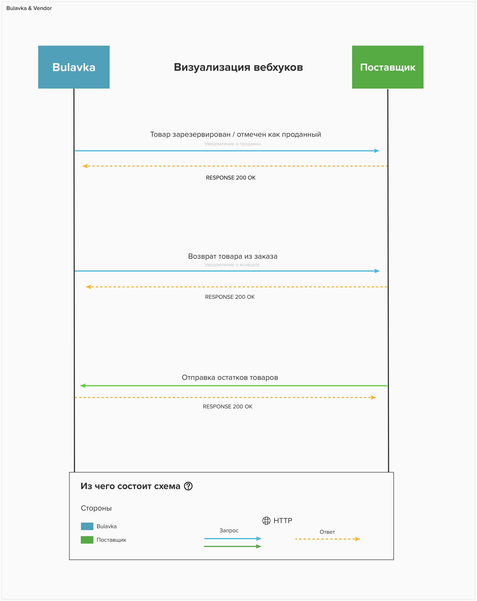

# HTTP Webhooks

Вебхуки можно использовать для различных целей, начиная с простых уведомлений, 
до синхронизации данных между системами (данный механизм позволит обеспечить целостность данных.)

## Что такое вебхук?

Вебхук (англ. Webhook) — метод расширения или изменения поведения веб-страницы или веб-приложения
с помощью обратных вызовов. Эти обратные вызовы могут поддерживаться, изменяться и
управляться сторонними пользователями и разработчиками, которые не обязательно
связаны с исходным веб-сайтом или приложением.

## Пример сценария

Визуализация схемы работы хуков ***(смотрите фото ниже)***



Таким образом, вебхуки можно использовать для различных целей, начиная с простых уведомлений - 
до синхронизации данных между системами.

## Пример запроса

При обработке хуков, вы будете получать следующие данные, конкретно о продажах и возвратах. ***(смотрите пример ниже)***

```json 
{
  "products": [
    {
      "id": Number,
      "sizes": [
        {
          "value": String,
          "count": Number,
          "soldCount": Number,
          "sizeId": Number
        }
        ...
      ]
    }
    ...
  ]
}
```

## Как поставщик уведомляет об остатках?

Для того что бы добиться двухсторонней синхронизации, сторона поставщика должна уведомлять об остатках товара. 
Сперва вам необходимо зайти в личный кабинет, в раздел настройки и скопировать следующее значение:


| Поле      | Описание                                                     |
|-----------|--------------------------------------------------------------|
| API URL   | На данный URL адрес необходимо отправлять данные об остатках |
| API Token | Необходимо отправлять при каждом обращении к API URL         |


> Authorization: Bearer :token

Вместо :token вставьте ваш API Token.

Данные необходимо отправлять в следующем виде:

```json
// Структура данных
{
  "supplierProductId": String
  "action": String // allowed values: receipts, sold, cancel, return, price
  "newPrice": Number
  "sizes": [
    {
      "value": String
      "count": Number
    }
  ]
}

// Пример
{
  "supplierProductId": "SS21CA2N",
  "action": "sold",
  "newPrice": 76000,
  "sizes": [
    {
      "value": "XL", // required
      "count": 2, // required
      "soldCount": 1, // optional
      "sizeId": 5 // optional
    }
  ]
}
```